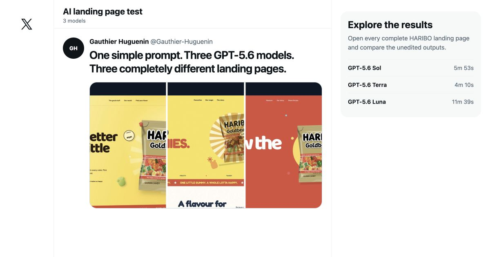

# GPT-5.6 x HARIBO landing page comparison

One prompt, three independent Codex CLI sessions and three complete landing pages generated by GPT-5.6 Sol, Terra and Luna.

[](https://gauthier-huguenin.github.io/haribo-gpt-5.6-comparison/)

## Live results

- [Comparison gallery](https://gauthier-huguenin.github.io/haribo-gpt-5.6-comparison/)
- [Sol output](https://gauthier-huguenin.github.io/haribo-gpt-5.6-comparison/sol/)
- [Terra output](https://gauthier-huguenin.github.io/haribo-gpt-5.6-comparison/terra/)
- [Luna output](https://gauthier-huguenin.github.io/haribo-gpt-5.6-comparison/luna/)

The three output folders are preserved as generated. The comparison gallery and this documentation were added afterwards to present the experiment.

## Prompt

> No skills are allowed. Create a beautiful landing page for HARIBO using only plain AI. Make it playful, colorful, and tangy. Use the real HARIBO logo and download real candy product images from the web. It must have at least five sections, with the hero section on top.

## Experimental method

- One empty folder per model
- The exact same prompt for every run
- Medium reasoning effort
- Separate interactive Codex CLI sessions
- No starter files or shared context
- One attempt per model
- No manual cleanup inside the three generated outputs

## Recorded run results

| Model | Duration | Input tokens | Cached input | Output tokens | API estimate |
| --- | ---: | ---: | ---: | ---: | ---: |
| GPT-5.6 Sol | 5m 53s | 776,412 | 694,528 | 14,161 | $1.18 |
| GPT-5.6 Terra | 4m 10s | 649,495 | 597,760 | 9,563 | $0.42 |
| GPT-5.6 Luna | 11m 39s | 758,752 | 659,712 | 8,733 | $0.22 |

The runs were included in a Codex subscription. The amounts are API-equivalent estimates calculated from recorded token usage and OpenAI's public standard pricing on July 16, 2026. They are not actual charges.

## Reproducible artifact measurements

The repository includes a dependency-free measurement script. It reports file sizes and basic document structure without assigning subjective quality scores.

```bash
python3 scripts/measure-artifacts.py
```

The committed snapshot is available in [`analysis/artifact-metrics.json`](analysis/artifact-metrics.json).

| Model | HTML | CSS | JavaScript | Local assets | DOM elements | Images |
| --- | ---: | ---: | ---: | ---: | ---: | ---: |
| Sol | 10.4 KiB | 18.5 KiB | 2.5 KiB | 3,818.5 KiB | 260 | 12 |
| Terra | 5.0 KiB | 10.4 KiB | 0.3 KiB | 716.8 KiB | 147 | 5 |
| Luna | 5.7 KiB | 8.1 KiB | 0.2 KiB | 1,256.3 KiB | 140 | 7 |

These measurements describe implementation size, not design quality. Sol produced the richest and heaviest artifact. Terra produced the smallest asset payload. Luna used the least CSS and JavaScript.

## What this experiment can and cannot show

It can show how three model variants handled one identical frontend brief in independent sessions. It also preserves the complete artifacts so readers can inspect the outputs rather than relying on selected screenshots.

It cannot establish a general model ranking:

- each model was run only once;
- the prompt covers one brand and one frontend task;
- visual assessment remains partly subjective;
- no controlled browser performance or accessibility benchmark was recorded during generation;
- model behavior and pricing can change after the recorded date.

A rigorous benchmark would require repeated runs, a predefined scoring rubric, blinded reviewers and automated browser measurements. The labels shown in the gallery are therefore observations about these three outputs, not universal claims about the models.

## Repository layout

```text
sol/                         Complete Sol output
terra/                       Complete Terra output
luna/                        Complete Luna output
assets/                      Comparison gallery previews
analysis/artifact-metrics.json  Reproducible metrics snapshot
scripts/measure-artifacts.py    Dependency-free measurement script
index.html                   Comparison gallery
```

## Disclaimer

This repository is an independent educational AI comparison. It is not affiliated with, endorsed by or sponsored by HARIBO. HARIBO names, logos, packaging and product imagery belong to their respective owners.
